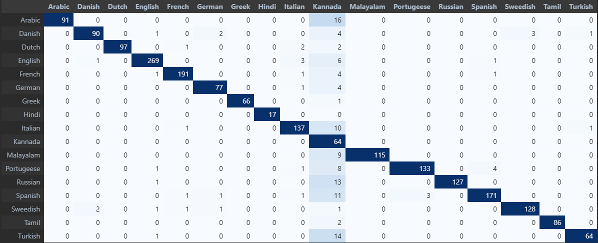

# language-detection-app
This is a language detection app that works with AI models and is deployed with Flask.
The AI model consits of a CountVectorizer to encode all different words into a known dataset of words, then RandomForestClassifier that classifies a CountVector into a set of numbers and finally a LabelEncoder that transcripts the number into the language of interest. Many languages are available such as English, Spanish, Portuguese, French, Dutch, German, Greek, Hindi, and many more.

To execute it on your local machine, clone the directory and execute the `main.py` in the `app` folder in a terminal.

Precision is shown to be 0.93 and the following is the confusion matrix.

